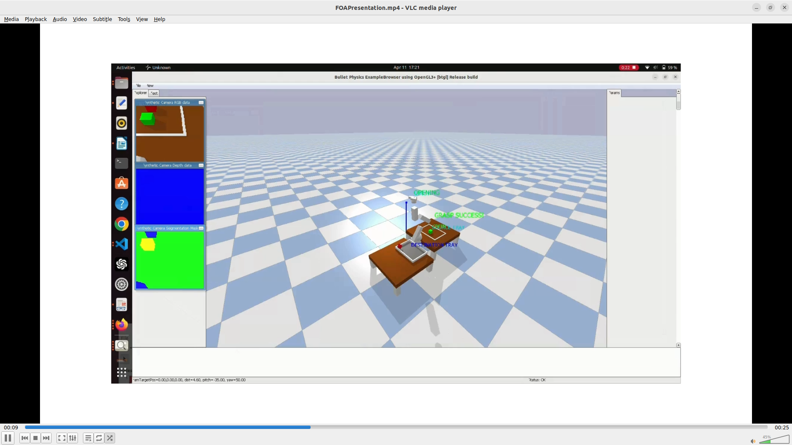
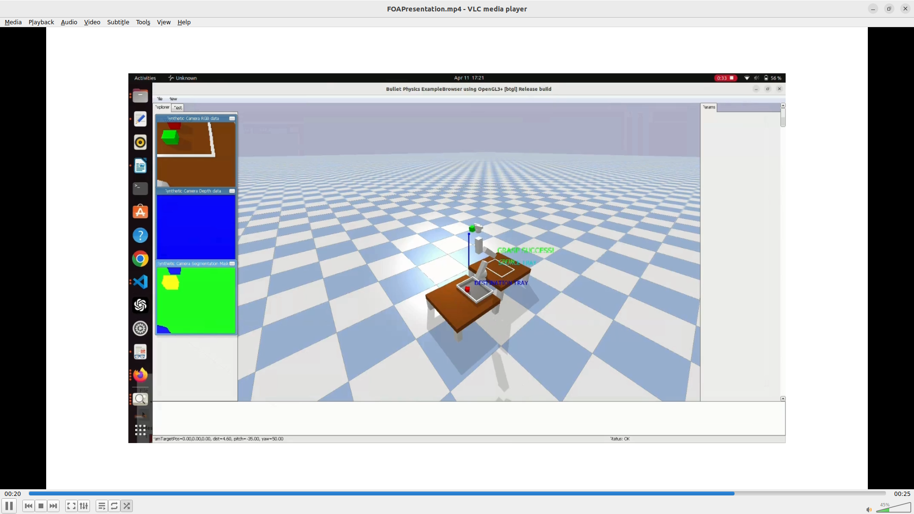
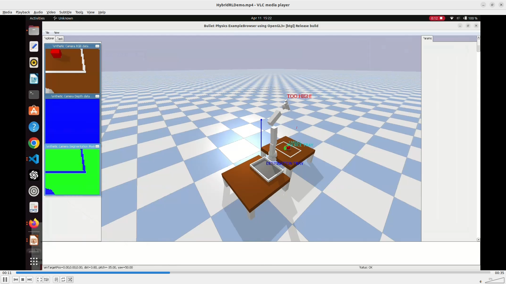
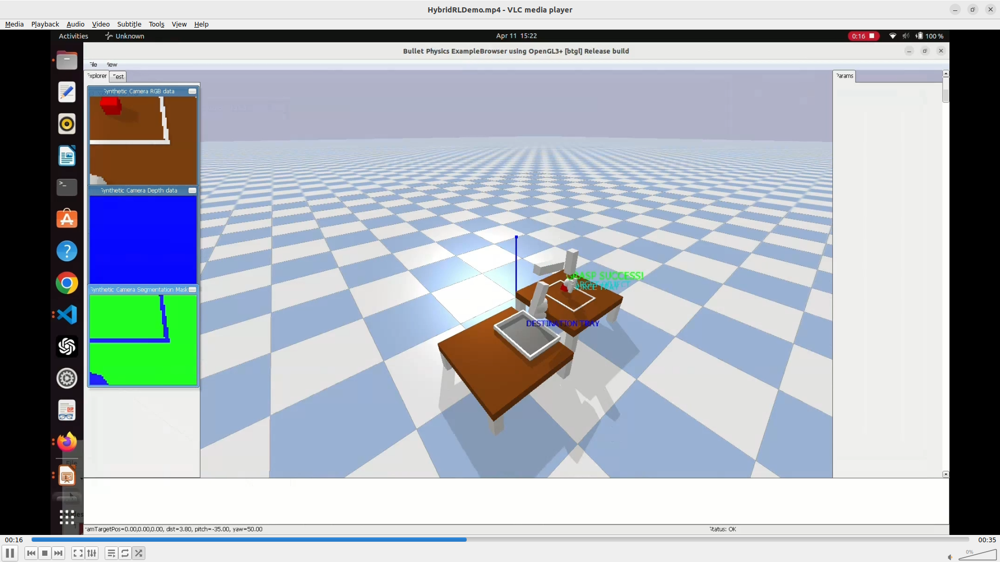
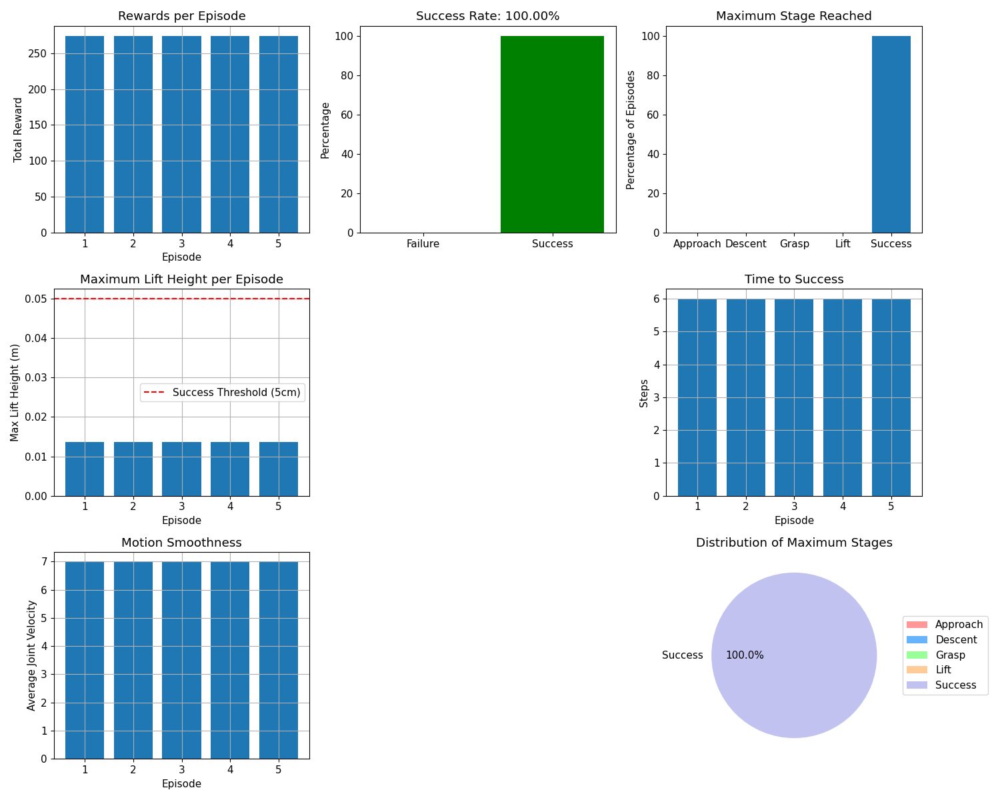

# Reinforcement Learning Integrated with Vision-Based Control​ : Robotic Arm Pick-and-Place System​

This project implements a reinforcement learning (RL) framework for training a robotic arm to perform object grasping and manipulation in a simulated environment. It uses PyBullet for physics simulation and uses Stable-Baselines3's implementation of the Soft Actor-Critic (SAC) algorithm to enable continuous control learning. Through iterative interaction with the environment, the robotic arm learns to perform precise and reliable grasping actions, guided by reward feedback and staged task objectives.

## Project Overview

The project focuses on training a robotic arm to:
1. Detect and localize objects using YOLOv5
2. Navigate and position the end-effector precisely above the object
3. Descend and perform a stable grasp using a two-finger gripper
4. Lift, transport, and place the object in a designated drop zone

## Policy Architecture

A custom **Soft Actor-Critic (SAC)** policy combines a **CNN** and **MLP** feature extractor to process observations [img,state] from the environment.

### CNN (Visual Input)

Processes 64×64 RGB images from the robot’s simulated camera and extracts spatial features useful for object localization.

### MLP (State Input)

Processes a 26-dimensional state vector containing:
- 7 joint angles  
- 7 joint velocities  
- 3D end-effector position (x, y, z)  
- 3D relative position between end-effector and object  
- 3D YOLO-estimated object position  

### Combination

The outputs from the CNN and MLP are concatenated into a combined feature vector, which is passed to the SAC policy network.

### Action Output

The policy outputs a **7-dimensional continuous action vector**:
- 6 joint position commands  
- 1 gripper control value

## 3D Object Position Estimation (YOLOv5 + Depth)

Object positions are estimated in 3D using 2D object detection from YOLOv5 and the depth buffer provided by PyBullet.

### YOLOv5 Detection

- YOLOv5 returns bounding boxes in image coordinates.
- The center of each bounding box is used as the detected object's 2D pixel location `(cx, cy)`.

### Depth Mapping

- The depth value at the detected pixel is extracted from the PyBullet depth buffer.
- Real-world depth Z is computed using the formula:

  Z = (near * far) / (far - (far - near) * z_buffer)

  Where:
- z_buffer is the normalized depth value at (cx, cy)
- near and far are the near and far clipping planes of the virtual camera

### Back-Projection to 3D

Using intrinsic camera parameters (focal length fx, image center cx0, cy0), the 3D camera-frame coordinates are computed as:

X = (cx - cx0) * Z / fx  
Y = (cy - cy0) * Z / fy


### World Frame Transformation

- The (X, Y, Z) coordinates are translated to the global simulation frame by adding the camera’s world position (eye)
- This produces an accurate 3D estimate of the object's location relative to the robot

**This process enables the robot to perform grasping and manipulation based on vision alone, using RGB-D input.**


## Technologies Used

- **PyBullet** – Physics simulation for robotic environments
- **YOLOv5** – Real-time object detection from RGB images
- **Stable-Baselines3 (SAC)** – Reinforcement learning algorithm for continuous control
- **OpenCV** and **PyTorch** – Image processing and deep learning integration
- **NumPy** and **Matplotlib** – Data handling, numerical computations, and visualizations

## Directory Structure

```
RL_results/                             # Results from multiple training iterations

Manual_Testing/                         # Testing scripts for individual components
├── Single object/                      # Tests with a single object
│   ├── manual_test_singleobject.py
│   └── env_setup.py                    # Single object environment setup
│
├── Multi object/                       # Tests with multiple objects
│   ├── manual_test_multiobject.py
│   └── env_setup_multiobject.py        # Multi object environment setup

Misc scripts/                           # Support scripts and utilities
├── Test limitations results/           # Evaluation of system constraints
├── Yolo detection results/             # Object detection performance
└── Various utility scripts             # Helper scripts for testing and setup

RL_Testing_Folder/                      # Core reinforcement learning implementation
├── RL_train.py                         # Main training script
├── cnn_policy.py                       # Custom CNN policy implementation
├── env_setup_multiobject.py            # Environment setup for RL
├── hybrid_training_4.py                # Hybrid RL/manual control logic
├── staged_training_3.py                # Staged reward training
├── models/                             # Trained model checkpoints
└── test_agent.py                       # Evaluation script for trained models

computer vision scripts/                # Computer vision implementation
├── cv_testing.py                       # Vision component testing
├── env_setup_multiobject_cv.py         # CV-integrated environment
└── sac_grasping_state.zip              # Trained model snapshot

fai_data_set/                           # Data used for YOLOv5 training

generate_urdfs.py                       # URDF generation script

requirements.txt                        # Python package dependencies
```


## How to Run the Project

### Step 1: Clone the Repository

```bash
git clone https://github.com/anushamanohar/CS5100.git
cd repo_name
```

### Step 2: Install Dependencies

Make sure you have Python 3.8+ installed on your system. Then, install the dependencies:

```bash
pip install -r requirements.txt
```

### Step 3: Run Training

To train a new model using the optimized parameters:

```bash
python hybrid_training_4.py --train --timesteps 150000 --hybrid
```

Parameters:
- `--train`: Enables training mode
- `--timesteps`: Number of timesteps for training (default: 150000)
- `--render`: Enable rendering during training
- `--seed`: Random seed (default: 0)
- `--learning_rate`: Learning rate for training (default: 0.0001)
- `--checkpoint`: Resume training from checkpoint
- `--continue_training`: Continue training metrics from checkpoint
- `--hybrid`: Use hybrid RL/manual control approach (default)
- `--no_hybrid`: Use pure RL approach (no manual control)

### Step 4: Test the Model

To test a trained model:

```bash
python hybrid_training_4.py --test logs/optimized_training/final_model --episodes 10 --hybrid
```

Parameters:
- `--test`: Path to the model to test
- `--episodes`: Number of test episodes (default: 10)
- `--hybrid`: Use hybrid RL/manual control approach (default)
- `--no_hybrid`: Use pure RL approach (no manual control)

## Environment Details

The environment consists of a robotic arm with grasping capabilities, placed on a table with objects to manipulate. The robot's goal is to grasp an object from one location and place it in a designated tray.

Key features:
- Visual observations using a simulated camera
- Object detection using YOLOv5
- State-based representation including joint angles, velocities, and positions
- Staged rewards for progressive skill learning

## Approach

### Pure RL Approach
Uses Soft Actor-Critic (SAC) with a custom CNN policy to handle both visual and state information.

### Hybrid Approach
Combines RL for initial positioning with proven manual control sequences for the final approach and grasping phase. This approach significantly improves success rates.

## Training Methodology

The system uses a staged reward approach to break down the complex task of grasping:
1. Stage 0: Approach and position above the object
2. Stage 1: Descend to grasp position
3. Stage 2: Close gripper to grasp the object
4. Stage 3: Lift the object
5. Stage 4: Success - object lifted to target height

The hybrid approach integrates proven manual control sequences to handle the more precise grasping requirements.

## Future Enhancements

- Improve object variety and difficulty
- Transfer to real robotic hardware
- Implement more complex manipulation tasks
- Optimize for speed and efficiency
- Improve the CNN architecture for better visual processing
- Extend the current Hybrid RL model to do the drop sequence along with the existing grasp sequence as well

## Contributors

1. Shruti Pasumarti
2. Anusha Manohar
3. Spencer Karofsky
4. Hemanth Sai Madadapu

## Manual Testing Result Images

<h3>Manipulation Process</h3>

<!-- Step 1 and Step 2 side by side -->
<p float="left">
  
  
</p>

<!-- Step 3 below -->
<p>
  
</p>

## Hybrid RL Result Images

<h3>Manipulation Process</h3>

<p float="left">
  
  
</p>

## Conclusion

This project presents a vision-integrated reinforcement learning system for robotic pick-and-place tasks. By combining YOLOv5 for object detection, depth-based 3D localization, and a custom SAC policy, the robot learns to autonomously detect, grasp, and relocate objects in simulation. A hybrid control strategy and staged rewards significantly improve reliability and learning stability.
The plot below demonstrates a 100% success rate achieved using this hybrid RL approach, highlighting its effectiveness. 


